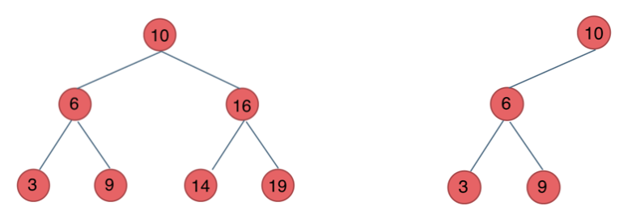

# 二叉树理论基础篇


## 题目分类


## 二叉树的种类

### 满二叉树

满二叉树：如果一棵二叉树只有度为0的结点和度为2的结点，并且度为0的结点在同一层上，则这棵二叉树为满二叉树。


这棵二叉树为满二叉树，也可以说深度为k，有2^k-1个节点的二叉树

### 完全二叉树

什么是完全二叉树？

完全二叉树的定义如下：在完全二叉树中，除了最底层节点可能没填满外，其余每层节点数都达到最大值，并且最下面一层的节点都集中在该层最左边的若干位置。若最底层为第 h 层（h从1开始），则该层包含 1~ 2^(h-1) 个节点。


### 二叉搜索树

前面介绍的树，都没有数值的，而二叉搜索树是有数值的了，**二叉搜索树是一个有序树**。

- 若它的左子树不空，则左子树上所有结点的值均小于它的根结点的值；
- 若它的右子树不空，则右子树上所有结点的值均大于它的根结点的值；
- 它的左、右子树也分别为二叉排序树

下面这两棵树都是搜索树



###  平衡二叉搜索树

平衡二叉搜索树：又被称为AVL（Adelson-Velsky and Landis）树，且具有以下性质：它是一棵空树或它的左右两个子树的高度差的绝对值不超过1，并且左右两个子树都是一棵平衡二叉树。

如图：


最后一棵 不是平衡二叉树，因为它的左右两个子树的高度差的绝对值超过了1。

**C++中map、set、multimap，multiset的底层实现都是平衡二叉搜索树**，所以map、set的增删操作时间时间复杂度是logn，注意我这里没有说unordered_map、unordered_set，unordered_map、unordered_set底层实现是哈希表。

## 二叉树的存储方式

**二叉树可以链式存储，也可以顺序存储。**

那么链式存储方式就用指针， 顺序存储的方式就是用数组。

顾名思义就是顺序存储的元素在内存是连续分布的，而链式存储则是通过指针把分布在各个地址的节点串联一起。

链式存储如图：


链式存储是大家很熟悉的一种方式，那么我们来看看如何顺序存储呢？

其实就是用数组来存储二叉树，顺序存储的方式如图：


用数组来存储二叉树如何遍历的呢？

**如果父节点的数组下标是 i，那么它的左孩子就是 i \* 2 + 1，右孩子就是 i \* 2 + 2。**

但是用链式表示的二叉树，更有利于我们理解，所以一般我们都是用链式存储二叉树。

## 二叉树的遍历方式

关于二叉树的遍历方式，要知道二叉树遍历的基本方式都有哪些。

一些同学用做了很多二叉树的题目了，可能知道前中后序遍历，可能知道层序遍历，但是却没有框架。

我这里把二叉树的几种遍历方式列出来，大家就可以一一串起来了。

二叉树主要有两种遍历方式：

1. 深度优先遍历：先往深走，遇到叶子节点再往回走。
2. 广度优先遍历：一层一层的去遍历。

**这两种遍历是图论中最基本的两种遍历方式**，后面在介绍图论的时候 还会介绍到。

那么从深度优先遍历和广度优先遍历进一步拓展，才有如下遍历方式：

- 深度优先遍历
  - 前序遍历（递归法，迭代法）
  - 中序遍历（递归法，迭代法）
  - 后序遍历（递归法，迭代法）
- 广度优先遍历
  - 层次遍历（迭代法）

在深度优先遍历中：有三个顺序，前中后序遍历， 有同学总分不清这三个顺序，经常搞混，我这里教大家一个技巧。

**这里前中后，其实指的就是中间节点的遍历顺序**，只要大家记住 前中后序指的就是中间节点的位置就可以了。

看如下中间节点的顺序，就可以发现，中间节点的顺序就是所谓的遍历方式

- 前序遍历：中左右
- 中序遍历：左中右
- 后序遍历：左右中

大家可以对着如下图，看看自己理解的前后中序有没有问题


最后再说一说二叉树中深度优先和广度优先遍历实现方式，我们做二叉树相关题目，经常会使用递归的方式来实现深度优先遍历，也就是实现前中后序遍历，使用递归是比较方便的。

**之前我们讲栈与队列的时候，就说过栈其实就是递归的一种实现结构**，也就说前中后序遍历的逻辑其实都是可以借助栈使用递归的方式来实现的。

而广度优先遍历的实现一般使用队列来实现，这也是队列先进先出的特点所决定的，因为需要先进先出的结构，才能一层一层的来遍历二叉树。

**这里其实我们又了解了栈与队列的一个应用场景了。**

具体的实现我们后面都会讲的，这里大家先要清楚这些理论基础。

##  二叉树的定义

刚刚我们说过了二叉树有两种存储方式顺序存储，和链式存储，顺序存储就是用数组来存，这个定义没啥可说的，我们来看看链式存储的二叉树节点的定义方式。

```python
class TreeNode:
    def __init__(self, val, left = None, right = None):
        self.val = val
        self.left = left
        self.right = right
```


大家会发现二叉树的定义 和链表是差不多的，相对于链表 ，二叉树的节点里多了一个指针， 有两个指针，指向左右孩子。

这里要提醒大家要注意二叉树节点定义的书写方式。

**在现场面试的时候 面试官可能要求手写代码，所以数据结构的定义以及简单逻辑的代码一定要锻炼白纸写出来。**

因为我们在刷leetcode的时候，节点的定义默认都定义好了，真到面试的时候，需要自己写节点定义的时候，有时候会一脸懵逼！

# 二叉数的递归遍历

##  思路

这次我们要好好谈一谈递归，为什么很多同学看递归算法都是“一看就会，一写就废”。

主要是对递归不成体系，没有方法论，**每次写递归算法 ，都是靠玄学来写代码**，代码能不能编过都靠运气。

**本篇将介绍前后中序的递归写法，一些同学可能会感觉很简单，其实不然，我们要通过简单题目把方法论确定下来，有了方法论，后面才能应付复杂的递归。**

这里帮助大家确定下来递归算法的三个要素。**每次写递归，都按照这三要素来写，可以保证大家写出正确的递归算法！**

1. **确定递归函数的参数和返回值：** 确定哪些参数是递归的过程中需要处理的，那么就在递归函数里加上这个参数， 并且还要明确每次递归的返回值是什么进而确定递归函数的返回类型。
2. **确定终止条件：** 写完了递归算法, 运行的时候，经常会遇到栈溢出的错误，就是没写终止条件或者终止条件写的不对，操作系统也是用一个栈的结构来保存每一层递归的信息，如果递归没有终止，操作系统的内存栈必然就会溢出。
3. **确定单层递归的逻辑：** 确定每一层递归需要处理的信息。在这里也就会重复调用自己来实现递归的过程。

好了，我们确认了递归的三要素，接下来就来练练手：

**以下以前序遍历为例：**

1. **确定递归函数的参数和返回值**：因为要打印出前序遍历节点的数值，所以参数里需要传入vector来放节点的数值，除了这一点就不需要再处理什么数据了也不需要有返回值，所以递归函数返回类型就是void，代码如下：

```c++
void traversal(TreeNode* cur, vector<int>& vec)
```

2.**确定终止条件**：在递归的过程中，如何算是递归结束了呢，当然是当前遍历的节点是空了，那么本层递归就要结束了，所以如果当前遍历的这个节点是空，就直接return，代码如下：

```c++
if (cur == NULL) return;
```

3.**确定单层递归的逻辑**：前序遍历是中左右的循序，所以在单层递归的逻辑，是要先取中节点的数值，代码如下：

```c++
vec.push_back(cur->val);    // 中
traversal(cur->left, vec);  // 左
traversal(cur->right, vec); // 右
```

单层递归的逻辑就是按照中左右的顺序来处理的，这样二叉树的前序遍历，基本就写完了，再看一下完整代码：

前序遍历：

```c++
class Solution {
public:
    void traversal(TreeNode* cur, vector<int>& vec) {
        if (cur == NULL) return;
        vec.push_back(cur->val);    // 中
        traversal(cur->left, vec);  // 左
        traversal(cur->right, vec); // 右
    }
    vector<int> preorderTraversal(TreeNode* root) {
        vector<int> result;
        traversal(root, result);
        return result;
    }
};
```

那么前序遍历写出来之后，中序和后序遍历就不难理解了，代码如下：

中序遍历：

```c++
void traversal(TreeNode* cur, vector<int>& vec) {
    if (cur == NULL) return;
    traversal(cur->left, vec);  // 左
    vec.push_back(cur->val);    // 中
    traversal(cur->right, vec); // 右
}
```

后序遍历：

```c++
void traversal(TreeNode* cur, vector<int>& vec) {
    if (cur == NULL) return;
    traversal(cur->left, vec);  // 左
    traversal(cur->right, vec); // 右
    vec.push_back(cur->val);    // 中
}
```

此时大家可以做一做leetcode上三道题目，分别是：

- [144.二叉树的前序遍历(opens new window)](https://leetcode.cn/problems/binary-tree-preorder-traversal/)
- [145.二叉树的后序遍历(opens new window)](https://leetcode.cn/problems/binary-tree-postorder-traversal/)
- [94.二叉树的中序遍历(opens new window)](https://leetcode.cn/problems/binary-tree-inorder-traversal/)

可能有同学感觉前后中序遍历的递归太简单了，要打迭代法（非递归），别急，我们明天打迭代法，打个通透！

## python

```python
# 前序遍历-递归-LC144_二叉树的前序遍历
# Definition for a binary tree node.
# class TreeNode:
#     def __init__(self, val=0, left=None, right=None):
#         self.val = val
#         self.left = left
#         self.right = right

class Solution:
    def preorderTraversal(self, root: TreeNode) -> List[int]:
        res = []
        
        def dfs(node):
            if node is None:
                return
            
            res.append(node.val)
            dfs(node.left)
            dfs(node.right)
        dfs(root)
        return res
```

# 二叉树的迭代遍历

## 思路

为什么可以用迭代法（非递归的方式）来实现二叉树的前后中序遍历呢？

我们在[栈与队列：匹配问题都是栈的强项 (opens new window)](https://programmercarl.com/1047.删除字符串中的所有相邻重复项.html)中提到了，**递归的实现就是：每一次递归调用都会把函数的局部变量、参数值和返回地址等压入调用栈中**，然后递归返回的时候，从栈顶弹出上一次递归的各项参数，所以这就是递归为什么可以返回上一层位置的原因。

此时大家应该知道我们用栈也可以是实现二叉树的前后中序遍历了。

### [#](https://programmercarl.com/二叉树的迭代遍历.html#前序遍历-迭代法)前序遍历（迭代法）

我们先看一下前序遍历。

前序遍历是中左右，每次先处理的是中间节点，那么先将根节点放入栈中，然后将右孩子加入栈，再加入左孩子。

为什么要先加入 右孩子，再加入左孩子呢？ 因为这样出栈的时候才是中左右的顺序。

动画如下：


不难写出如下代码: （**注意代码中空节点不入栈**）

```python
class Solution {
public:
    vector<int> preorderTraversal(TreeNode* root) {
        stack<TreeNode*> st;
        vector<int> result;
        if (root == NULL) return result;
        st.push(root);
        while (!st.empty()) {
            TreeNode* node = st.top();                       // 中
            st.pop();
            result.push_back(node->val);
            if (node->right) st.push(node->right);           // 右（空节点不入栈）
            if (node->left) st.push(node->left);             // 左（空节点不入栈）
        }
        return result;
    }
};
```

此时会发现貌似使用迭代法写出前序遍历并不难，确实不难。

**此时是不是想改一点前序遍历代码顺序就把中序遍历搞出来了？**

其实还真不行！

但接下来，**再用迭代法写中序遍历的时候，会发现套路又不一样了，目前的前序遍历的逻辑无法直接应用到中序遍历上。**

### 中序遍历（迭代法）

为了解释清楚，我说明一下 刚刚在迭代的过程中，其实我们有两个操作：

1. **处理：将元素放进result数组中**
2. **访问：遍历节点**

分析一下为什么刚刚写的前序遍历的代码，不能和中序遍历通用呢，因为前序遍历的顺序是中左右，先访问的元素是中间节点，要处理的元素也是中间节点，所以刚刚才能写出相对简洁的代码，**因为要访问的元素和要处理的元素顺序是一致的，都是中间节点。**

那么再看看中序遍历，中序遍历是左中右，先访问的是二叉树顶部的节点，然后一层一层向下访问，直到到达树左面的最底部，再开始处理节点（也就是在把节点的数值放进result数组中），这就造成了**处理顺序和访问顺序是不一致的。**

那么**在使用迭代法写中序遍历，就需要借用指针的遍历来帮助访问节点，栈则用来处理节点上的元素。**

动画如下：


**中序遍历，可以写出如下代码：**

```c++
class Solution {
public:
    vector<int> inorderTraversal(TreeNode* root) {
        vector<int> result;
        stack<TreeNode*> st;
        TreeNode* cur = root;
        while (cur != NULL || !st.empty()) {
            if (cur != NULL) { // 指针来访问节点，访问到最底层
                st.push(cur); // 将访问的节点放进栈
                cur = cur->left;                // 左
            } else {
                cur = st.top(); // 从栈里弹出的数据，就是要处理的数据（放进result数组里的数据）
                st.pop();
                result.push_back(cur->val);     // 中
                cur = cur->right;               // 右
            }
        }
        return result;
    }
};

```

### 后序遍历（迭代法）

再来看后序遍历，先序遍历是中左右，后序遍历是左右中，那么我们只需要调整一下先序遍历的代码顺序，就变成中右左的遍历顺序，然后在反转result数组，输出的结果顺序就是左右中了，如下图：


**所以后序遍历只需要前序遍历的代码稍作修改就可以了，代码如下：**

```c++
class Solution {
public:
    vector<int> postorderTraversal(TreeNode* root) {
        stack<TreeNode*> st;
        vector<int> result;
        if (root == NULL) return result;
        st.push(root);
        while (!st.empty()) {
            TreeNode* node = st.top();
            st.pop();
            result.push_back(node->val);
            if (node->left) st.push(node->left); // 相对于前序遍历，这更改一下入栈顺序 （空节点不入栈）
            if (node->right) st.push(node->right); // 空节点不入栈
        }
        reverse(result.begin(), result.end()); // 将结果反转之后就是左右中的顺序了
        return result;
    }
};

```

##  总结

此时我们用迭代法写出了二叉树的前后中序遍历，大家可以看出前序和中序是完全两种代码风格，并不像递归写法那样代码稍做调整，就可以实现前后中序。

**这是因为前序遍历中访问节点（遍历节点）和处理节点（将元素放进result数组中）可以同步处理，但是中序就无法做到同步！**

上面这句话，可能一些同学不太理解，建议自己亲手用迭代法，先写出来前序，再试试能不能写出中序，就能理解了。

**那么问题又来了，难道二叉树前后中序遍历的迭代法实现，就不能风格统一么（即前序遍历改变代码顺序就可以实现中序 和 后序）？**

当然可以，这种写法，还不是很好理解，我们将在下一篇文章里重点讲解，敬请期待！

## python

```python
# 前序遍历-迭代-LC144_二叉树的前序遍历
class Solution:
    def preorderTraversal(self, root: TreeNode) -> List[int]:
        # 根结点为空则返回空列表
        if not root:
            return []
        stack = [root]
        result = []
        while stack:
            node = stack.pop()
            # 中结点先处理
            result.append(node.val)
            # 右孩子先入栈
            if node.right:
                stack.append(node.right)
            # 左孩子后入栈
            if node.left:
                stack.append(node.left)
        return result
```

```python
# 中序遍历-迭代-LC94_二叉树的中序遍历
class Solution:
    def inorderTraversal(self, root: TreeNode) -> List[int]:
        if not root:
            return []
        stack = []  # 不能提前将root结点加入stack中
        result = []
        cur = root
        while cur or stack:
            # 先迭代访问最底层的左子树结点
            if cur:     
                stack.append(cur)
                cur = cur.left		
            # 到达最左结点后处理栈顶结点    
            else:		
                cur = stack.pop()
                result.append(cur.val)
                # 取栈顶元素右结点
                cur = cur.right	
        return result
```

```python
# 后序遍历-迭代-LC145_二叉树的后序遍历
class Solution:
   def postorderTraversal(self, root: TreeNode) -> List[int]:
       if not root:
           return []
       stack = [root]
       result = []
       while stack:
           node = stack.pop()
           # 中结点先处理
           result.append(node.val)
           # 左孩子先入栈
           if node.left:
               stack.append(node.left)
           # 右孩子后入栈
           if node.right:
               stack.append(node.right)
       # 将最终的数组翻转
       return result[::-1]
```

