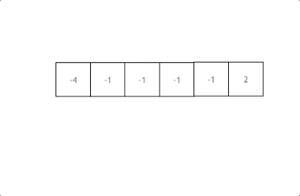
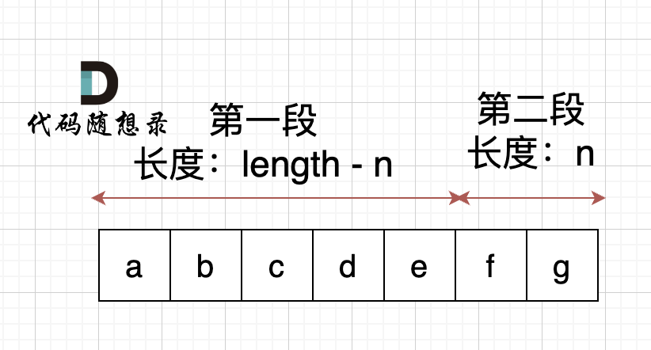
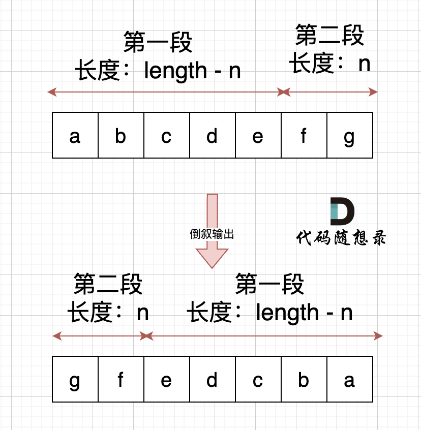

# 代码随想录

https://programmercarl.com/%E5%93%88%E5%B8%8C%E8%A1%A8%E7%90%86%E8%AE%BA%E5%9F%BA%E7%A1%80.html

## 哈希表

### 242.有效的字母异位词

[力扣题目链接](https://leetcode.cn/problems/valid-anagram/description/)

给定两个字符串 s 和 t ，编写一个函数来判断 t 是否是 s 的字母异位词。

示例 1: 输入: s = "anagram", t = "nagaram" 输出: true

示例 2: 输入: s = "rat", t = "car" 输出: false

**说明:** 你可以假设字符串只包含小写字母

#### 写法一

```python
class Solution:
    def isAnagram(self, s: str, t: str) -> bool:
        record = [0] * 26
        for i in s:
            #并不需要记住字符a的ASCII，只要求出一个相对数值就可以了
            record[ord(i) - ord("a")] += 1
        for i in t:
            record[ord(i) - ord("a")] -= 1
        for i in range(26):
            if record[i] != 0:
                #record数组如果有的元素不为零0，说明字符串s和t 一定是谁多了字符或者谁少了字符。
                return False
        return True
```

#### 写法二

```python
class Solution:
    def isAnagram(self, s: str, t: str) -> bool:
        from collections import defaultdict
        
        s_dict = defaultdict(int)
        t_dict = defaultdict(int)
        for x in s:
            s_dict[x] += 1
        
        for x in t:
            t_dict[x] += 1
        return s_dict == t_dict
```

关于collections 和defaultdict

`collections` 模块是一个包含了一系列扩展了内建容器类型（如 `dict`，`list`，`set` 和 `tuple`）的特殊容器数据类型的模块。`defaultdict` 是这个模块中的一个类，它是对内建 `dict` 类的一个扩展。

`defaultdict` 的主要特点是它允许你指定一个默认的数据类型，如果你尝试访问字典中不存在的键时，`defaultdict` 会自动为该键创建一个默认值。这个默认值可以是任何类型的，包括数字、字符串、列表等。

#### 写法三

```python
class Solution(object):
    def isAnagram(self, s: str, t: str) -> bool:
        from collections import Counter
        a_count = Counter(s)
        b_count = Counter(t)
        return a_count == b_count
```

`Counter` 是 `collections` 模块中的一个类，它用于计数可哈希对象（hashable objects）的出现次数。你可以使用 `Counter` 来统计一个序列中各个元素的出现频率。

`Counter` 类提供了一些常用的统计方法，如 `update()`，用于添加新的元素，以及 `most_common()`，用于获取出现次数最多的元素列表。

### 349. 两个数组的交集

[力扣题目链接](https://leetcode.cn/problems/intersection-of-two-arrays/description/)

#### 思路

1、输出结果中的每个元素一定是唯一的，也就是说输出的结果的去重的， 同时可以不考虑输出结果的顺序

2、使用数组来做哈希的题目，是因为题目都限制了数值的大小。而这道题目没有限制数值的大小，就无法使用数组来做哈希表了。

3、而且如果哈希值比较少、特别分散、跨度非常大，使用数组就造成空间的极大浪费。

#### 补充知识点拓展

那有同学可能问了，遇到哈希问题我直接都用set不就得了，用什么数组啊。

直接使用set 不仅占用空间比数组大，而且速度要比数组慢，set把数值映射到key上都要做hash计算的。

不要小瞧 这个耗时，在数据量大的情况，差距是很明显的。

#### 版本一：使用字典和集合

```python
class Solution:
    def intersection(self, nums1: List[int], nums2: List[int]) -> List[int]:
        table={}
        for num in nums1:
            table[num]=table.get(num,0)+1

        res=set()
        for num in nums2:
            if num in table:
                res.add(num)
                del table[num]
        return list(res)
        
```

#### 版本二：使用数组

```python
class Solution:
    def intersection(self, nums1: List[int], nums2: List[int]) -> List[int]:
        count1=[0]*1001
        count2=[0]*1001
        result=[]
        for i in range(len(nums1)):
            count1[nums1[i]]+=1
        for j in range(len(nums2)):
            count2[nums2[j]]+=1
        for k in range(1001):
            if count1[k]*count2[k]>0:
                result.append(k)
        return result
```

#### 版本三：使用集合

```python
class Solution:
    def intersection(self, nums1: List[int], nums2: List[int]) -> List[int]:
        return list(set(nums1) & set(nums2))
```

### 202. 快乐数

[力扣题目链接](https://leetcode.cn/problems/happy-number/)

#### 思路

当我们遇到了要快速判断一个元素是否出现集合里的时候，就要考虑哈希法了。

#### 版本一：集合

```python
class Solution:
    def isHappy(self, n: int) -> bool:
        record=set()

        while True:
            n=self.get_sum(n)
            if n==1:
                return True
            
            if n in record:
                return False
            else:
                record.add(n)

        
 
    def get_sum(self,n:int)->int:
        new_num=0
        while n:
            n,r=divmod(n,10)
            new_num+=r**2
        return new_num
```

`divmod(n, 10)`函数用于将数字n除以10，并返回一个包含商和余数的元组。商是n除以10的整数部分，余数是n除以10的余数。

#### 版本二：集合

```python
class Solution:
    def isHappy(self, n: int) -> bool:
        record=set()
        while n not in record:
            record.add(n)
            new_num=0
            n_str=str(n)
            for i in n_str:
                new_num+=int(i)**2
            if new_num==1:
                return True
            else:
                n=new_num
        return False
```

#### 版本三：使用数组

```python
class Solution:
   def isHappy(self, n: int) -> bool:
       record = []
       while n not in record:
           record.append(n)
           new_num = 0
           n_str = str(n)
           for i in n_str:
               new_num+=int(i)**2
           if new_num==1: return True
           else: n = new_num
       return False
```

#### 版本四：使用快慢指针

```python
class Solution:
    def isHappy(self, n: int) -> bool:
        slow,fast=n,n
        while self.get_sum(fast)!=1 and self.get_sum(self.get_sum(fast)):
            slow=self.get_sum(slow)
            fast=self.get_sum(self.get_sum(fast))
            if slow==fast:
                return False
        return True


    def get_sum(self,n: int) -> int: 
       new_num = 0
       while n:
           n, r = divmod(n, 10)
           new_num += r ** 2
       return new_num
```

n分解后的平方，快指针分解两次。慢指针分解一次往下分解到符合条件

#### 版本五：集合+精简

```python
class Solution:
   def isHappy(self, n: int) -> bool:
       seen = set()
       while n != 1:
           n = sum(int(i) ** 2 for i in str(n))
           if n in seen:
               return False
           seen.add(n)
       return True
```

#### 版本六：数组+精简

```python
class Solution:
   def isHappy(self, n: int) -> bool:
       seen = []
       while n != 1:
           n = sum(int(i) ** 2 for i in str(n))
           if n in seen:
               return False
           seen.append(n)
       return True
```

### 1.两数之和

[力扣题目链接](https://leetcode.cn/problems/two-sum/description/)

#### 思路1

两层for循环查找，时间复杂度为O(n^2)

##### 实现方案

```python
class Solution:
    def twoSum(self, nums: List[int], target: int) -> List[int]:
        for i in range(len(nums)):
            for j in range(i+1, len(nums)):
                if nums[i] + nums[j] == target:
                    return [i,j]
```


#### 思路2

 **什么时候使用哈希法**，当我们需要查询一个元素是否出现过，或者一个元素是否在集合里的时候，就要第一时间想到哈希法。

需要一个集合来存放我们遍历过的元素，然后在遍历数组的时候去询问这个集合，某元素是否遍历过，也就是 是否出现在这个集合。

因为本题，我们不仅要知道元素有没有遍历过，还要知道这个元素对应的下标，**需要使用 key value结构来存放，key来存元素，value来存下标，那么使用map正合适**。

再来看一下使用数组和set来做哈希法的局限。

- 数组的大小是受限制的，而且如果元素很少，而哈希值太大会造成内存空间的浪费。
- set是一个集合，里面放的元素只能是一个key，而两数之和这道题目，不仅要判断y是否存在而且还要记录y的下标位置，因为要返回x 和 y的下标。所以set 也不能用。

此时就要选择另一种数据结构：map ，map是一种key value的存储结构，可以用key保存数值，用value再保存数值所在的下标。

接下来需要明确两点：

- **map用来做什么**
- **map中key和value分别表示什么**

map目的用来存放我们访问过的元素，因为遍历数组的时候，需要记录我们之前遍历过哪些元素和对应的下标，这样才能找到与当前元素相匹配的（也就是相加等于target）

接下来是map中key和value分别表示什么。

这道题 我们需要 给出一个元素，判断这个元素是否出现过，如果出现过，返回这个元素的下标。

那么判断元素是否出现，这个元素就要作为key，所以数组中的元素作为key，有key对应的就是value，value用来存下标。

所以 map中的存储结构为 {key：数据元素，value：数组元素对应的下标}。

在遍历数组的时候，只需要向map去查询是否有和目前遍历元素匹配的数值，如果有，就找到的匹配对，如果没有，就把目前遍历的元素放进map中，因为map存放的就是我们访问过的元素。

##### 总结

- 为什么会想到用哈希表
- 哈希表为什么用map
- 本题map是用来存什么的
- map中的key和value用来存什么的

##### 版本一（使用字典）

```python
class Solution:
    def twoSum(self, nums: List[int], target: int) -> List[int]:
        records = dict()

        for index, value in enumerate(nums):  
            if target - value in records:   # 遍历当前元素，并在map中寻找是否有匹配的key
                return [records[target- value], index]
            records[value] = index    # 如果没找到匹配对，就把访问过的元素和下标加入到map中
        return []
```

##### 版本二(使用集合)

```python
class Solution:
    def twoSum(self, nums: List[int], target: int) -> List[int]:
        #创建一个集合来存储我们目前看到的数字
        seen = set()             
        for i, num in enumerate(nums):
            complement = target - num
            if complement in seen:
                return [nums.index(complement), i]
            seen.add(num)
```

#### 版本三（双指针）

```python
class Solution:
    def twoSum(self, nums: List[int], target: int) -> List[int]:
        # 对输入列表进行排序
        nums_sorted = sorted(nums)
        
        # 使用双指针
        left = 0
        right = len(nums_sorted) - 1
        while left < right:
            current_sum = nums_sorted[left] + nums_sorted[right]
            if current_sum == target:
                # 如果和等于目标数，则返回两个数的下标
                left_index = nums.index(nums_sorted[left])
                right_index = nums.index(nums_sorted[right])
                if left_index == right_index:
                    right_index = nums[left_index+1:].index(nums_sorted[right]) + left_index + 1
                return [left_index, right_index]
            elif current_sum < target:
                # 如果总和小于目标，则将左侧指针向右移动
                left += 1
            else:
                # 如果总和大于目标值，则将右指针向左移动
                right -= 1
```

### 454.四数相加II

[力扣题目链接](https://leetcode.cn/problems/4sum-ii/description/)

#### 思路

本题解题步骤：

1. 首先定义 一个unordered_map，key放a和b两数之和，value 放a和b两数之和出现的次数。
2. 遍历大A和大B数组，统计两个数组元素之和，和出现的次数，放到map中。
3. 定义int变量count，用来统计 a+b+c+d = 0 出现的次数。
4. 在遍历大C和大D数组，找到如果 0-(c+d) 在map中出现过的话，就用count把map中key对应的value也就是出现次数统计出来。
5. 最后返回统计值 count 就可以了

##### 版本一：使用字典

```python
class Solution(object):
    def fourSumCount(self, nums1, nums2, nums3, nums4):
        # 使用字典存储nums1和nums2中的元素及其和
        hashmap = dict()
        for n1 in nums1:
            for n2 in nums2:
                if n1 + n2 in hashmap:
                    hashmap[n1+n2] += 1
                else:
                    hashmap[n1+n2] = 1
        
        # 如果 -(n1+n2) 存在于nums3和nums4, 存入结果
        count = 0
        for n3 in nums3:
            for n4 in nums4:
                key = - n3 - n4
                if key in hashmap:
                    count += hashmap[key]
        return count
```

##### 版本二：

```python
class Solution(object):
    def fourSumCount(self, nums1, nums2, nums3, nums4):
        # 使用字典存储nums1和nums2中的元素及其和
        hashmap = dict()
        for n1 in nums1:
            for n2 in nums2:
                hashmap[n1+n2] = hashmap.get(n1+n2, 0) + 1
        
        # 如果 -(n1+n2) 存在于nums3和nums4, 存入结果
        count = 0
        for n3 in nums3:
            for n4 in nums4:
                key = - n3 - n4
                if key in hashmap:
                    count += hashmap[key]
        return count
```


##### 版本三：使用defaultdict

```python
from collections import defaultdict 
class Solution:
    def fourSumCount(self, nums1: list, nums2: list, nums3: list, nums4: list) -> int:
        rec, cnt = defaultdict(lambda : 0), 0
        for i in nums1:
            for j in nums2:
                rec[i+j] += 1
        for i in nums3:
            for j in nums4:
                cnt += rec.get(-(i+j), 0) 
        return cnt
```

在Python中，`defaultdict` 是 `collections` 模块中的一个类，它是内置的 `dict` 类的一个子类。`defaultdict` 的主要特点是它允许你指定一个默认的数据类型，如果你尝试访问字典中不存在的键时，`defaultdict` 会自动为该键创建一个默认值。

当你使用 `defaultdict(lambda: 0)` 时，你创建了一个默认值为0的默认字典。这意味着任何未在字典中显式定义的键都会自动被赋予一个0值。

### 383.赎金信

[力扣题目链接](https://leetcode.cn/problems/ransom-note/)

#### 思路1哈希解法

因为题目说只有小写字母，那可以采用空间换取时间的哈希策略，用一个长度为26的数组来记录magazine里字母出现的次数。

然后再用ransomNote去验证这个数组是否包含了ransomNote所需要的所有字母。

依然是数组在哈希法中的应用。

##### 版本1使用数组

```python
class Solution:
    def canConstruct(self, ransomNote: str, magazine: str) -> bool:
        ransom_count = [0] * 26
        magazine_count = [0] * 26
        for c in ransomNote:
            ransom_count[ord(c) - ord('a')] += 1
        for c in magazine:
            magazine_count[ord(c) - ord('a')] += 1
        return all(ransom_count[i] <= magazine_count[i] for i in range(26))
```

在Python编程语言中，`all(ransom_count[i]<=magazine_count[i] for i in range(26))` 这行代码的作用是检查一个条件在循环中是否对所有的元素都为真。

`ord`函数在处理文本数据，尤其是需要进行字符比较或编码转换时非常有用。需要注意的是，如果传递给`ord`的字符串长度大于1，或者不是字符类型，Python会抛出`TypeError`。

##### 版本2使用defaultdict

```python
from collections import defaultdict

class Solution:
    def canConstruct(self, ransomNote: str, magazine: str) -> bool:

        hashmap = defaultdict(int)

        for x in magazine:
            hashmap[x] += 1

        for x in ransomNote:
            value = hashmap.get(x)
            if not value or not value:
                return False
            else:
                hashmap[x] -= 1

        return True
```

在Python中，`defaultdict`是`collections`模块中的一个类，它是内置的`dict`类的一个子类。`defaultdict`的特点是它会为不存在的键提供一个默认值，这个默认值是由你传递给`defaultdict`的工厂函数生成的。

当你使用`int`作为工厂函数时，`defaultdict(int)`会创建一个字典，当尝试访问一个不存在的键时，它会自动为该键分配一个默认值`0`。这在处理计数问题时非常有用，因为你不需要预先为所有可能的键设置初始值。

`hashmap.get(x)`是调用哈希映射（通常是一个字典）的`get`方法，用于获取键`x`对应的值。如果键`x`存在于哈希映射中，`get`方法将返回与之关联的值。如果键`x`不存在，`get`方法将返回`None`，或者返回你作为第二个参数传递的默认值。

##### 版本3使用字典

```python
class Solution:
    def canConstruct(self, ransomNote: str, magazine: str) -> bool:
        counts = {}
        for c in magazine:
            counts[c] = counts.get(c, 0) + 1
        for c in ransomNote:
            if c not in counts or counts[c] == 0:
                return False
            counts[c] -= 1
        return True
```

1. `counts.get(c, 0)`: 这部分使用`get`方法从字典`counts`中获取键`c`对应的值。如果键`c`不存在于字典中，`get`方法将返回第二个参数`0`作为默认值。这意味着如果`c`是第一次出现，它的计数将被视为`0`。
2. `+ 1`: 这部分将`get`方法返回的值加`1`，这样就实现了对字符`c`的计数。

##### 版本4使用Counter

```python
from collections import Counter

class Solution:
    def canConstruct(self, ransomNote: str, magazine: str) -> bool:
        return not Counter(ransomNote) - Counter(magazine)
```

在Python中，`Counter`是`collections`模块中的一个类，它是一个字典子类，用于计数可哈希对象（如字母、单词等）。`Counter`对象会存储每个元素出现的次数作为一个字典，其中键是元素，值是元素的计数。

##### 版本5使用count

```python
class Solution:
    def canConstruct(self, ransomNote: str, magazine: str) -> bool:
        return all(ransomNote.count(c) <= magazine.count(c) for c in set(ransomNote))
```

在Python中，`ansomNote.count(c)`是调用字符串`ansomNote`的`count`方法，用于计算字符串中字符`c`出现的次数。这里的`c`代表一个字符，而不是一个字符串。

##### 版本6使用count

```python
class Solution:
    def canConstruct(self, ransomNote: str, magazine: str) -> bool:
        for char in ransomNote:
            if char in magazine and ransomNote.count(char) <= magazine.count(char):
                continue
            else:
                return False
        return True
```

`ransomNote.count(char) <= magazine.count(char)` 这行代码是一个条件表达式，用于比较字符`char`在两个字符串`ransomNote`和`magazine`中出现的次数。这个条件检查`ransomNote`中`char`的出现次数是否小于或等于`magazine`中`char`的出现次数。

### 15.三数之和

[力扣题目链接](https://leetcode.cn/problems/3sum/description/)

#### 思路——哈希解法

两层for循环就可以确定 a 和b 的数值了，可以使用哈希法来确定 0-(a+b) 是否在 数组里出现过，其实这个思路是正确的，但是我们有一个非常棘手的问题，就是题目中说的不可以包含重复的三元组。

##### 版本:使用字典

```python
class Solution:
    def threeSum(self, nums: List[int]) -> List[List[int]]:
        result = []
        nums.sort()
        # 找出a + b + c = 0
        # a = nums[i], b = nums[j], c = -(a + b)
        for i in range(len(nums)):
            # 排序之后如果第一个元素已经大于零，那么不可能凑成三元组
            if nums[i] > 0:
                break
            if i > 0 and nums[i] == nums[i - 1]: #三元组元素a去重
                continue
            d = {}
            for j in range(i + 1, len(nums)):
                if j > i + 2 and nums[j] == nums[j-1] == nums[j-2]: # 三元组元素b去重
                    continue
                c = 0 - (nums[i] + nums[j])
                if c in d:
                    result.append([nums[i], nums[j], c])
                    d.pop(c) # 三元组元素c去重
                else:
                    d[nums[j]] = j
        return result
```


#### 思路——双指针

**其实这道题目使用哈希法并不十分合适**，因为在去重的操作中有很多细节需要注意，在面试中很难直接写出没有bug的代码。

而且使用哈希法 在使用两层for循环的时候，能做的剪枝操作很有限，虽然时间复杂度是O(n^2)，也是可以在leetcode上通过，但是程序的执行时间依然比较长 。

接下来我来介绍另一个解法：双指针法，**这道题目使用双指针法 要比哈希法高效一些**，那么来讲解一下具体实现的思路。



拿这个nums数组来举例，首先将数组排序，然后有一层for循环，i从下标0的地方开始，同时定一个下标left 定义在i+1的位置上，定义下标right 在数组结尾的位置上。

依然还是在数组中找到 abc 使得a + b +c =0，我们这里相当于 a = nums[i]，b = nums[left]，c = nums[right]。

接下来如何移动left 和right呢， 如果nums[i] + nums[left] + nums[right] > 0 就说明 此时三数之和大了，因为数组是排序后了，所以right下标就应该向左移动，这样才能让三数之和小一些。

如果 nums[i] + nums[left] + nums[right] < 0 说明 此时 三数之和小了，left 就向右移动，才能让三数之和大一些，直到left与right相遇为止。

##### a的去重

说到去重，其实主要考虑三个数的去重。 a, b ,c, 对应的就是 nums[i]，nums[left]，nums[right]

a 如果重复了怎么办，a是nums里遍历的元素，那么应该直接跳过去。

但这里有一个问题，是判断 nums[i] 与 nums[i + 1]是否相同，还是判断 nums[i] 与 nums[i-1] 是否相同。

有同学可能想，这不都一样吗。

其实不一样！

都是和 nums[i]进行比较，是比较它的前一个，还是比较它的后一个。

如果我们的写法是 这样：

```python
if (nums[i] == nums[i + 1]) { // 去重操作
    continue;
}
```

 那我们就把 三元组中出现重复元素的情况直接pass掉了。 例如{-1, -1 ,2} 这组数据，当遍历到第一个-1 的时候，判断 下一个也是-1，那这组数据就pass了。

**我们要做的是 不能有重复的三元组，但三元组内的元素是可以重复的！**

所以这里是有两个重复的维度。

那么应该这么写：

```python
if (i > 0 && nums[i] == nums[i - 1]) {
    continue;
}
```

这么写就是当前使用 nums[i]，我们判断前一位是不是一样的元素，在看 {-1, -1 ,2} 这组数据，当遍历到 第一个 -1 的时候，只要前一位没有-1，那么 {-1, -1 ,2} 这组数据一样可以收录到 结果集里。

这是一个非常细节的思考过程。

##### b与c的去重

很多同学写本题的时候，去重的逻辑多加了 对right 和left 的去重：（代码中注释部分）

```python
while (right > left) {
    if (nums[i] + nums[left] + nums[right] > 0) {
        right--;
        // 去重 right
        while (left < right && nums[right] == nums[right + 1]) right--;
    } else if (nums[i] + nums[left] + nums[right] < 0) {
        left++;
        // 去重 left
        while (left < right && nums[left] == nums[left - 1]) left++;
    } else {
    }
}
```

但细想一下，这种去重其实对提升程序运行效率是没有帮助的。

拿right去重为例，即使不加这个去重逻辑，依然根据 `while (right > left)` 和 `if (nums[i] + nums[left] + nums[right] > 0)` 去完成right-- 的操作。

多加了 `while (left < right && nums[right] == nums[right + 1]) right--;` 这一行代码，其实就是把 需要执行的逻辑提前执行了，但并没有减少 判断的逻辑。

最直白的思考过程，就是right还是一个数一个数的减下去的，所以在哪里减的都是一样的。

所以这种去重 是可以不加的。 仅仅是 把去重的逻辑提前了而已

##### 版本1：双指针

```python
class Solution:
    def threeSum(self, nums: List[int]) -> List[List[int]]:
        result = []
        nums.sort()
        
        for i in range(len(nums)):
            # 如果第一个元素已经大于0，不需要进一步检查
            if nums[i] > 0:
                return result
            
            # 跳过相同的元素以避免重复
            if i > 0 and nums[i] == nums[i - 1]:
                continue
                
            left = i + 1
            right = len(nums) - 1
            
            while right > left:
                sum_ = nums[i] + nums[left] + nums[right]
                
                if sum_ < 0:
                    left += 1
                elif sum_ > 0:
                    right -= 1
                else:
                    result.append([nums[i], nums[left], nums[right]])
                    
                    # 跳过相同的元素以避免重复
                    while right > left and nums[right] == nums[right - 1]:
                        right -= 1
                    while right > left and nums[left] == nums[left + 1]:
                        left += 1
                        
                    right -= 1
                    left += 1
                    
        return result
```

### 18.四数之和

[力扣题目链接](https://leetcode.cn/problems/4sum/description/)

#### 思路

四数之和，和[15.三数之和 (opens new window)](https://programmercarl.com/0015.三数之和.html)是一个思路，都是使用双指针法, 基本解法就是在[15.三数之和 (opens new window)](https://programmercarl.com/0015.三数之和.html)的基础上再套一层for循环。

但是有一些细节需要注意，例如： 不要判断`nums[k] > target` 就返回了，三数之和 可以通过 `nums[i] > 0` 就返回了，因为 0 已经是确定的数了，四数之和这道题目 target是任意值。比如：数组是`[-4, -3, -2, -1]`，`target`是`-10`，不能因为`-4 > -10`而跳过。但是我们依旧可以去做剪枝，逻辑变成`nums[i] > target && (nums[i] >=0 || target >= 0)`就可以了。

[15.三数之和 (opens new window)](https://programmercarl.com/0015.三数之和.html)的双指针解法是一层for循环num[i]为确定值，然后循环内有left和right下标作为双指针，找到nums[i] + nums[left] + nums[right] == 0。

四数之和的双指针解法是两层for循环nums[k] + nums[i]为确定值，依然是循环内有left和right下标作为双指针，找出nums[k] + nums[i] + nums[left] + nums[right] == target的情况，三数之和的时间复杂度是O(n^2)，四数之和的时间复杂度是O(n^3) 。

那么一样的道理，五数之和、六数之和等等都采用这种解法。

对于[15.三数之和 (opens new window)](https://programmercarl.com/0015.三数之和.html)双指针法就是将原本暴力O(n^3)的解法，降为O(n^2)的解法，四数之和的双指针解法就是将原本暴力O(n^4)的解法，降为O(n^3)的解法。

之前我们讲过哈希表的经典题目：[454.四数相加II (opens new window)](https://programmercarl.com/0454.四数相加II.html)，相对于本题简单很多，因为本题是要求在一个集合中找出四个数相加等于target，同时四元组不能重复。

而[454.四数相加II (opens new window)](https://programmercarl.com/0454.四数相加II.html)是四个独立的数组，只要找到A[i] + B[j] + C[k] + D[l] = 0就可以，不用考虑有重复的四个元素相加等于0的情况，所以相对于本题还是简单了不少！

##### 版本一:双指针

```py
class Solution:
    def fourSum(self, nums: List[int], target: int) -> List[List[int]]:
        nums.sort()
        n = len(nums)
        result = []
        for i in range(n):
            if nums[i] > target and nums[i] > 0 and target > 0:# 剪枝（可省）
                break
            if i > 0 and nums[i] == nums[i-1]:# 去重
                continue
            for j in range(i+1, n):
                if nums[i] + nums[j] > target and target > 0: #剪枝（可省）
                    break
                if j > i+1 and nums[j] == nums[j-1]: # 去重
                    continue
                left, right = j+1, n-1
                while left < right:
                    s = nums[i] + nums[j] + nums[left] + nums[right]
                    if s == target:
                        result.append([nums[i], nums[j], nums[left], nums[right]])
                        while left < right and nums[left] == nums[left+1]:
                            left += 1
                        while left < right and nums[right] == nums[right-1]:
                            right -= 1
                        left += 1
                        right -= 1
                    elif s < target:
                        left += 1
                    else:
                        right -= 1
        return result
```

关于去重参考三数之和解释


##### 版本二：使用字典

```python
class Solution(object):
    def fourSum(self, nums, target):
        """
        :type nums: List[int]
        :type target: int
        :rtype: List[List[int]]
        """
        # 创建一个字典来存储输入列表中每个数字的频率
        freq = {}
        for num in nums:
            freq[num] = freq.get(num, 0) + 1
        
        # 创建一个集合来存储最终答案，并遍历4个数字的所有唯一组合
        ans = set()
        for i in range(len(nums)):
            for j in range(i + 1, len(nums)):
                for k in range(j + 1, len(nums)):
                    val = target - (nums[i] + nums[j] + nums[k])
                    if val in freq:
                        # 确保没有重复
                        count = (nums[i] == val) + (nums[j] == val) + (nums[k] == val)
                        if freq[val] > count:
                            ans.add(tuple(sorted([nums[i], nums[j], nums[k], val])))
        
        return [list(x) for x in ans]
```

### 总结

## 字符串

### 344.反转字符串

[力扣题目链接](https://leetcode.cn/problems/reverse-string/description/)

swap可以两者实现

#### 常见交换

```
int tmp = s[i];
s[i] = s[j];
s[j] = tmp;
```

#### 位运算符

```
s[i] ^= s[j];
s[j] ^= s[i];
s[i] ^= s[j];
```

#### 版本一：使用双指针

```python
class Solution:
    def reverseString(self, s: List[str]) -> None:
        """
        Do not return anything, modify s in-place instead.
        """
        left, right = 0, len(s) - 1
        
        # 该方法已经不需要判断奇偶数，经测试后时间空间复杂度比用 for i in range(len(s)//2)更低
        # 因为while每次循环需要进行条件判断，而range函数不需要，直接生成数字，因此时间复杂度更低。推荐使用range
        while left < right:
            s[left], s[right] = s[right], s[left]
            left += 1
            right -= 1
```

这里为什么不会变成s[right]

#### 版本二：使用栈

```python
class Solution:
    def reverseString(self, s: List[str]) -> None:
        """
        Do not return anything, modify s in-place instead.
        """
        stack = []
        for char in s:
            stack.append(char)
        for i in range(len(s)):
            s[i] = stack.pop()
```

#### 版本三：使用range

```python
class Solution:
    def reverseString(self, s: List[str]) -> None:
        """
        Do not return anything, modify s in-place instead.
        """
        n = len(s)
        for i in range(n // 2):
            s[i], s[n - i - 1] = s[n - i - 1], s[i]
```

#### 版本四：使用reversed

```python
class Solution:
    def reverseString(self, s: List[str]) -> None:
        """
        Do not return anything, modify s in-place instead.
        """
        s[:] = reversed(s)
```

#### 版本五：使用切片

```python
class Solution:
    def reverseString(self, s: List[str]) -> None:
        """
        Do not return anything, modify s in-place instead.
        """
        s[:] = s[::-1]
```

#### 版本六：使用列表推导

```python
class Solution:
    def reverseString(self, s: List[str]) -> None:
        """
        Do not return anything, modify s in-place instead.
        """
        s[:] = [s[i] for i in range(len(s) - 1, -1, -1)]
```

#### 版本七：使用reverse

```python
class Solution:
    def reverseString(self, s: List[str]) -> None:
        """
        Do not return anything, modify s in-place instead.
        """
        # 原地反转,无返回值
        s.reverse()
```

### 541.反转字符串II

[力扣题目链接](https://leetcode.cn/problems/reverse-string-ii/description/)

#### 思路

**当需要固定规律一段一段去处理字符串的时候，要想想在在for循环的表达式上做做文章。**

```python
class Solution:
    def reverseStr(self, s: str, k: int) -> str:
        """
        1. 使用range(start, end, step)来确定需要调换的初始位置
        2. 对于字符串s = 'abc'，如果使用s[0:999] ===> 'abc'。字符串末尾如果超过最大长度，则会返回至字符串最后一个值，这个特性可以避免一些边界条件的处理。
        3. 用切片整体替换，而不是一个个替换.
        """
        def reverse_substring(text):
            left, right = 0, len(text) - 1
            while left < right:
                text[left], text[right] = text[right], text[left]
                left += 1
                right -= 1
            return text
        
        res = list(s)

        for cur in range(0, len(s), 2 * k):
            res[cur: cur + k] = reverse_substring(res[cur: cur + k])
        
        return ''.join(res)
```

```python
class Solution:
    def reverseStr(self, s: str, k: int) -> str:
        # Two pointers. Another is inside the loop.
        p = 0
        while p < len(s):
            p2 = p + k
            # Written in this could be more pythonic.
            s = s[:p] + s[p: p2][::-1] + s[p2:]
            p = p + 2 * k
        return s
```

### 替换数字

[卡码网题目链接](https://kamacoder.com/problempage.php?pid=1064)

#### 思路

**其实很多数组填充类的问题，其做法都是先预先给数组扩容带填充后的大小，然后在从后向前进行操作。**

这么做有两个好处：

1. 不用申请新数组。
2. 从后向前填充元素，避免了从前向后填充元素时，每次添加元素都要将添加元素之后的所有元素向后移动的问题。

```python
class Solution:
    def change(self, s):
        lst = list(s) # Python里面的string也是不可改的，所以也是需要额外空间的。空间复杂度：O(n)。
        for i in range(len(lst)):
            if lst[i].isdigit():
                lst[i] = "number"
        return ''.join(lst)
```

### 151.翻转字符串里的单词

[力扣题目链接](https://leetcode.cn/problems/reverse-words-in-a-string/description/)

#### 思路

**这道题目可以说是综合考察了字符串的多种操作。**

一些同学会使用split库函数，分隔单词，然后定义一个新的string字符串，最后再把单词倒序相加，那么这道题题目就是一道水题了，失去了它的意义。

所以这里我还是提高一下本题的难度：**不要使用辅助空间，空间复杂度要求为O(1)。**

不能使用辅助空间之后，那么只能在原字符串上下功夫了。

想一下，我们将整个字符串都反转过来，那么单词的顺序指定是倒序了，只不过单词本身也倒序了，那么再把单词反转一下，单词不就正过来了。

所以解题思路如下：

- 移除多余空格
- 将整个字符串反转
- 将每个单词反转

举个例子，源字符串为："the sky is blue "

- 移除多余空格 : "the sky is blue"
- 字符串反转："eulb si yks eht"
- 单词反转："blue is sky the"

#### 版本一

```python
class Solution:
    def reverseWords(self, s: str) -> str:
        # 删除前后空白
        s = s.strip()
        # 反转整个字符串
        s = s[::-1]
        # 将字符串拆分为单词，并反转每个单词
        s = ' '.join(word[::-1] for word in s.split())
        return s

```

#### 版本二：指针

```python
class Solution:
    def reverseWords(self, s: str) -> str:
        # 将字符串拆分为单词，即转换成列表类型
        words = s.split()

        # 反转单词
        left, right = 0, len(words) - 1
        while left < right:
            words[left], words[right] = words[right], words[left]
            left += 1
            right -= 1

        # 将列表转换成字符串
        return " ".join(words)
```

### 右旋字符串

[卡码网链接](https://kamacoder.com/problempage.php?pid=1065)

#### 思路

为了让本题更有意义，提升一下本题难度：**不能申请额外空间，只能在本串上操作**。 （Java不能在字符串上修改，所以使用java一定要开辟新空间）

不能使用额外空间的话，模拟在本串操作要实现右旋转字符串的功能还是有点困难的。

那么我们可以想一下上一题目[字符串：花式反转还不够！ (opens new window)](https://programmercarl.com/0151.翻转字符串里的单词.html)中讲过，使用整体反转+局部反转就可以实现反转单词顺序的目的。

本题中，我们需要将字符串右移n位，字符串相当于分成了两个部分，如果n为2，符串相当于分成了两个部分，如图： （length为字符串长度）



右移n位， 就是将第二段放在前面，第一段放在后面，先不考虑里面字符的顺序，是不是整体倒叙不就行了。如图



此时第一段和第二段的顺序是我们想要的，但里面的字符位置被我们倒叙，那么此时我们在把 第一段和第二段里面的字符再倒叙一把，这样字符顺序不就正确了。 如果：


思路就是 通过 整体倒叙，把两段子串顺序颠倒，两个段子串里的的字符在倒叙一把，**负负得正**，这样就不影响子串里面字符的顺序了

那么整体反正的操作放在下面，先局部反转行不行？

可以的，不过，要记得 控制好 局部反转的长度，如果先局部反转，那么先反转的子串长度就是 len - n，如图：


#### 版本

```python
#获取输入的数字k和字符串
k = int(input())
s = input()

#通过切片反转第一段和第二段字符串
#注意：python中字符串是不可变的，所以也需要额外空间
s = s[len(s)-k:] + s[:len(s)-k]
print(s)
```

